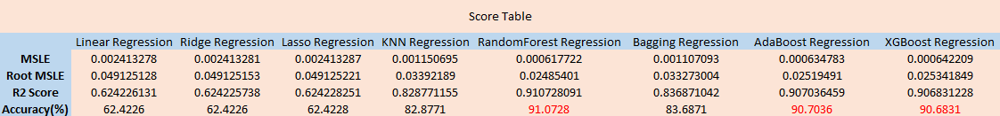
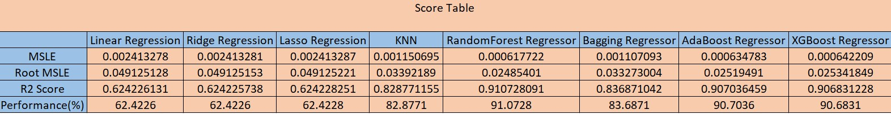

# Used Car sales - Feature Importance and prediction

- This application makes use of CRISP-DM framework

### CRISP-DM Framework

- To frame the task, throughout our practical applications we will refer to a standard process in industry for data projects called CRISP-DM.  
- This process provides a framework for working through a data problem.  
- Our first step in this application will be to read through a brief overview of CRISP-DM <a href="https://en.wikipedia.org/wiki/Cross-industry_standard_process_for_data_mining#:~:text=CRISPDM%20breaks%20the%20process%20of%20data%20mining%20into,Data%20Preparation%204%20Modeling%205%20Evaluation%206%20Deployment">here</a>

    

### Business Understanding

- In this application, we will explore a dataset that contains information on 426880 used cars. 
- Our goal is to understand what factors make a car more or less expensive. 
- As a result of this analysis, we should be able to provide clear recommendations to our client -- a used car dealership -- as to what consumers value in a used car.

### Data Understanding

- The data spans across ~27-yrs - from 1995 -2022
- Also, the price range of all the vehicles is approximately bet ~ $8k-$39k with some outlier to be eliminated
- The data has vehicles from all 51 states (50 states + Washington DC) in the US and 404 distinct regions
- There are a total of 42 unique manufacturers in the data
- There are a total of 29629 unique car models in the data
- The condition of the vehicle is classified in 6 unique categories 
    ('good', 'excellent', 'fair', 'like new', 'new', 'salvage')
- There are a total of 8 unique cylinder types listed in the data 
    ('8 cylinders', '6 cylinders', '4 cylinders', '5 cylinders', 'other', '3 cylinders', '10 cylinders', '12 cylinders')
- There are a total of 5 unique fuel attributes listed in the data 
    ('gas', 'other', 'diesel', 'hybrid', 'electric')
- There are a total of 5 unique title statuses listed in the data 
    ('clean', 'rebuilt', 'lien', 'salvage', 'missing', 'parts only')
- There are a total of 3 unique types of transmission listed in the data 
    ('other', 'automatic', 'manual')
- There are a total of 265838 unique VINs (Vehicle Identification Numbers) listed in the data
- There are a total of 3 unique dive-types are listed in the data 
    ('rwd', '4wd', 'fwd')
- There are a total of 4 unique vehicle sizes listed in the data 
    ('full-size', 'mid-size', 'compact', 'sub-compact')
- There are a total of 13 unique vehicle types listed in the data 
    ('pickup', 'truck', 'other', 'coupe', 'SUV', 'hatchback', 'mini-van','sedan', 'offroad', 'bus', 'van', 'convertible', 'wagon')
- There are a total of 12 unique paint colors listed in the data 
    ('white', 'blue', 'red', 'black', 'silver', 'grey', 'brown', 'yellow', 'orange', 'green', 'custom', 'purple')

- Majority of the columns except (id, region, price, and state) contained NULL values (NaN in data science terms)
- The data required significant cleansing as well as inferring the NULL values through Imputation

<pre>
- id              426880
- region          426880
- price           426880
- year            425675
- manufacturer    409234
- model           421603
- condition       252776
- cylinders       249202
- fuel            423867
- odometer        422480
- title_status    418638
- transmission    424324
- VIN             265838
- drive           296313
- size            120519
- type            334022
- paint_color     296677
- state           426880
</pre>

## Team collaboration - directory structure

<pre>
- bronze = raw data (accessed by Data Analysts)
- silver = pre-processed data - (accesses by Data Engineers)
- gold = curated data - (accessed by Data Scientists or Statisticians) 
</pre>

#### Instructions

- Get the raw data from - <a href="https://mo-pcco.s3.us-east-1.amazonaws.com/BH-PCMLAI/module_11/practical_application_II_starter.zip">here</a>
- Unzip the data into data/bronze folder and rename the file as "vehicles_raw.csv" for the notebooks to execute without any exceptions
- Please run the notebooks in exact sequence (1-4)
- The pre-processing step (data-preprocessing.ipynb) will progressively create two more data files in "data/silver" and "data/gold" folders
- At the end of step 3 (after the execution of model.ipynb), there will be 3 model .pkl files create in "models" folder
- We'll also notice "errors.csv" created in "data/gold" folder which contains the scores produced by the all the models (refer - score table below)

<pre>

├── data
│    ├── bronze 
|    |   ├── vehicles_raw.csv
│    ├── silver
|    |   ├── vehicles_silver.csv
|    ├── gold
|    |   ├── vehicles_gold.csv
|    |   ├── errors.csv
|
├── images
|    ├── all charts and sundry images
|
├── models
|    ├── RFRDeploy.pkl
|    ├── StandardScaler.pkl
|    ├── XGBoostDeploy.pkl
|
├── 1. data-preprocessing.ipynb
│   2. data-visualization.ipynb
|   3. models.ipynb
|   4. deployment.ipynb
|
├── presentation
|   ├── UsedCarDataMLSummary.pptx

</pre>

## Data Preparation and Visualization

<pre>
Input: vehicles_raw.csv
Output: vehicles_silver.csv
Code Used: Python
Packages: Pandas, Numpy, Matplotlib, Seaborn
</pre>

## Data Cleansing

<pre>
Input: vehicles_silver.csv
Output: vehicles_gold.csv

- IterativeImputer
- Estimators (BayesianRidge, DecisionTreeRegressor, ExtraTreesRegressor, KNeighborsRegressor)
- cross_val_score of calculated MSE
- Rationalization of # of rows and column expected

Rationalized Data points

- Shape before process = (426880, 18)
- Shape After process = (364420, 16)
- Total 62460 rows and 2 columns were removed
</pre>

## Data Processing

<pre>
- Label Encoding of categorical variables to transform into numerical values
- The dataset is not normally distributed
- sklearn library (MinMaxScaler)
- train_test_split (Train = 90% - Test = 10%)
</pre>

## Data Modeling

<pre>
Input: vehicles_gold.csv
Output: Model

- 1) Linear Regression
- 2) Ridge Regression
- 3) Lasso Regression
- 4) K-Neighbors Regression
- 5) Random Forest Regression
- 6) Bagging Regression
- 7) Adaboost Regression
- 8) XGBoost Regression
</pre>

## Evaluation

<pre>
- Provide the following input variables to - predict the price of the best used vehicle
- paint_color, manufacturer, year, transmission, cylinders, size, fuel, condition, drive, type, odometer
</pre>

## Model Deployment plan (Aspirations, not in current scope)

<pre>
- The resultant model can be deployed as a docker container and orchestrated on Kubernetes cluster
- The advantage of this approach is - we can orchestrate different versions of the models in different Kubernetes PODS 
- It also acts as a solutiona accelerator for other used car dealer and hence the solution becomes repeatable
</pre>

## Presentation

<pre>
- A Powerpoint presentation is included to explain the entire process in "Presentation" directory.
</pre>

## Process Summary

    

- By performing different Machine Learning models, we aimed to get a better result or less error with max accuracy. 
- Our purpose was to predict the price of the used cars with the help of multiple predictors for 364420 unique samples.
- Initially, data cleaning was performed to remove the null values (NaN) and outliers from the dataset.
- Next, the data visualization features were explored deeply to examine the correlation between the features.
- Subsequently, Machine Learning models were implemented to predict feature importance and the price of car for a given customer preference.
- From the table below, Random Forest, AdaBoost, and XGBoost are the best models for the prediction of the used car prices. 
- We chose 2 out of 3 best models and deployed Random Forest and XGBoost in production.

## Score Table - all models

    

## Visual Representation

    

